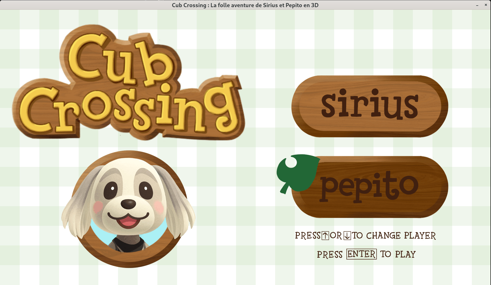
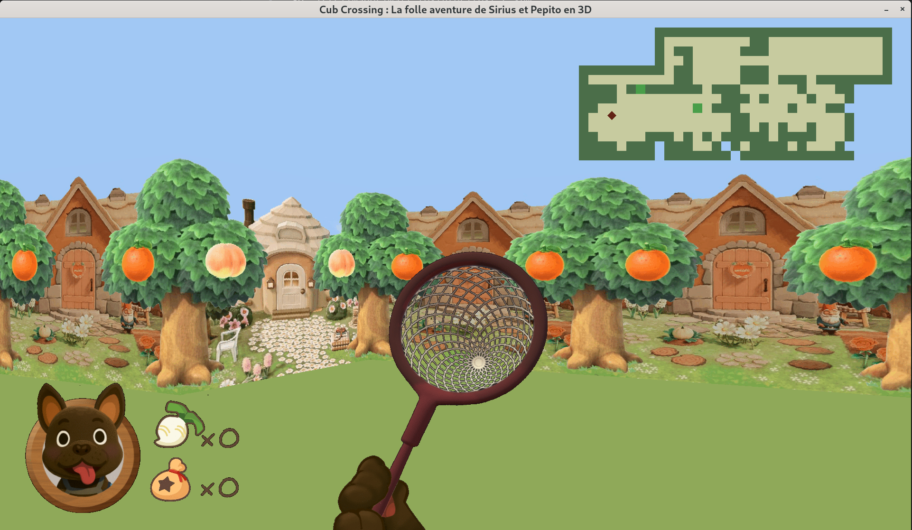
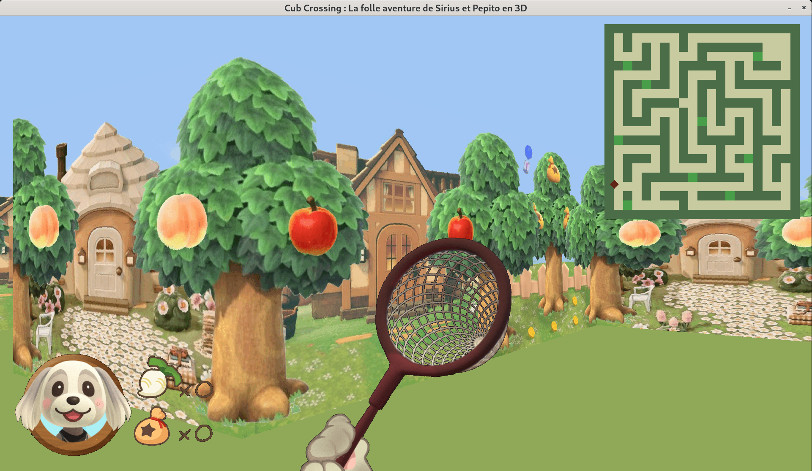

<!-- README.md -->
<h1 align="center">
  Cub3D  
</h1>

<p align="center">
  <code>$ ./cub3d map.cub</code><br>
  <i>A raycasting-based 3D engine inspired by Wolfenstein 3D, built for the 42 Common Core.</i><br>
  <strong>Developed in C by <a href="https://github.com/Melodycherry">@Melodycherry</a> & <a href="https://github.com/Hyliah">@Hyliah</a></strong>
</p>

<p align="center">
  
  
  
</p>

---

<h2 align="center">♦ Overview ♦</h2>

Cub3D is a small **3D rendering engine** implemented from scratch using classic **raycasting techniques**.  
The goal of this project is to explore low-level graphics, vector math, game architecture, and event-driven rendering using MiniLibX.<br>
Our take was to create an Animal Crossing version. A cute game dedicated to our beloved dogs Sirius and Pepito ! 

<p align="center">
  <!-- Optional: insert GIF -->
  
</p>

---

<h2>♦ Key Features ♦</h2>

- Mandatory part :
  -   Clean raycasting implementation (DDA)
  -   Textured wall projection  
  -   Map parsing (`.cub` format) with error handling
  -   RGB floor/ceiling shading
  -   Player movement based on vector math
  -   Modular architecture (parsing / rendering / input / utils)

- Bonus part :
  -   Collision detection
  -   Mouse mouvement
  -   Animated weapon (butterfly nett)
  -   Doors
  -   Minimap

- For our own pleasure :
  - Menu
  - Overlay
  - Character choice that impact the overlay and the weapon's designs


---

<h2> ♦ Project Structure ♦</h2>

```
cub3d/
├── main/               # Program entry & initialisation
├── src/
│  ├── custom_mlx/      # homwmade mlx_functions
│  ├── images/          # images files for the textures, overlay and weapons
│  ├── malloc_exit/     # functions file for clean malloc and programm exits
│  ├── maps/            # diverses file for testing parsing and play experience
│  ├── math/            # all math functions for the raycasting and player movement
│  ├── parsing/         # .cub file parsing
│  ├── screen/          # functions related to screen handling and the game rendering
│  └── utils/           # utility functions
├── includes/           # headers
├── attached/           # Libft and mlibx librairies
├── textures/           # XPM loader & sampling
├── utils/              # Helpers, errors
```


<h2>♦ Team Collaboration ♦</h2>

<p>

<strong>My contributions:</strong><br>
• Raycasting engine (math, DDA, projection)<br>
• Rendering logic and pixel color handling (get/set pixel, texture sampling)<br>
• Player movement, keyboard input system and collision logic<br>
• Visual design, UI elements and general aesthetic direction<br>
• Flood-fill logic<br>
• Gameplay & improved player interaction<br>

<br>

<strong>Melodycherry’s contributions:</strong><br>
• Full parsing architecture for <code>.cub</code> files<br>
• Texture path parsing (NO, SO, EA, WE) & validation<br>
• RGB color parsing with strict format checking<br>
• Map extraction, formatting and structure validation<br>
• Comprehensive error detection and descriptive error reporting<br>

<br>

<strong>Built together:</strong><br>
• Debugging session<br>
• Merge strategy and code structure choices<br>
• Mouse handling<br>
• Doors system<br>

</p>


<h2>♦ How to run ♦</h2>

```bash
# Clone the repository
git clone https://github.com/Hyliah/cub3D
cd cub3D

# Build
make

# Run
./cub3d maps/example.cub
```

<h2> ♦ Controls ♦ </h2>

```bash
W / A / S / D   → Movement
O               → Open Door
M               → Show/hide Minimap
← / →           → Rotate left/right
Drag Mouse      → Rotate left/right
↑ / ↓           → Brows player
ENTER           → Choose player
ESC             → Quit
```

<p align="center">
  
  
</p>
<p align="center">
  
  
</p>
<p align="center">  </p>
